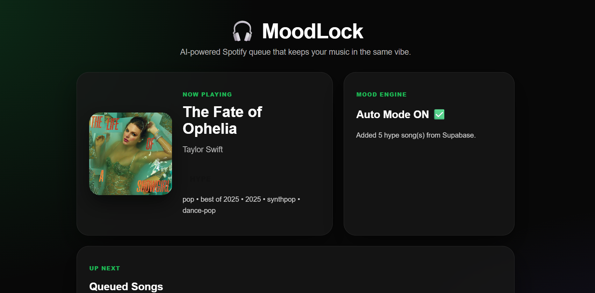
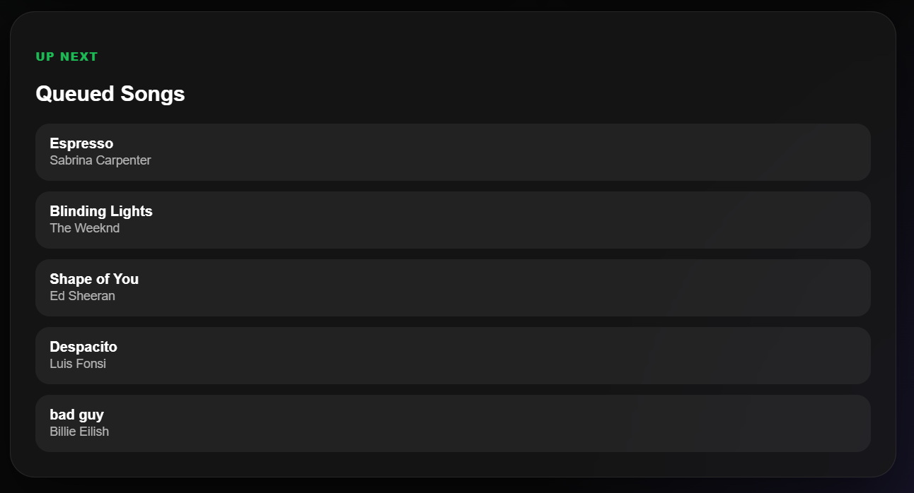
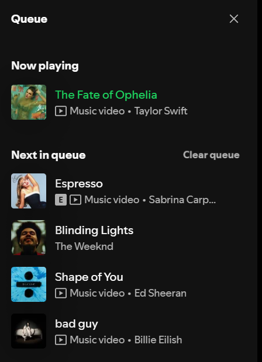

# 🎧 MoodLock

> Keep your Spotify queue in the same vibe.

MoodLock Queue is a Spotify-powered web app that automatically maintains a consistent music vibe. It detects the mood of the currently playing track and queues similar songs for a smooth listening experience.

---

## 🚀 Features

- 🔐 Spotify Login (OAuth)
- 🎵 Detect currently playing song
- 🧠 Mood detection using Last.fm
- 🔄 Auto queue similar songs
- 🚫 Loop prevention (no repeated songs)
- ⚡ Smart queue refill system
- 🎯 Consistent vibe listening

---

## 🛠️ Tech Stack

- React + Vite  
- Spotify Web API  
- Last.fm API  
- JavaScript

---

##🤖Environmental Variables

VITE_SPOTIFY_CLIENT_ID=92b2b4d3e8a44ecf8d217de7275b76a4

VITE_LASTFM_API_KEY=c3e6e830225eb531010bf8148927f167

VITE_SUPABASE_URL=https://zahxqfgjkdbtgdunjltu.supabase.co

VITE_SUPABASE_ANON_KEY=sb_publishable_W7bLPiT0jV32rot6E_MmVg_tCU2x3pX

---

## 📸 Screenshots

### 🏠 Home Screen

### 🎧 Queue Screen

### 🎵 Spotify Queue Screen

